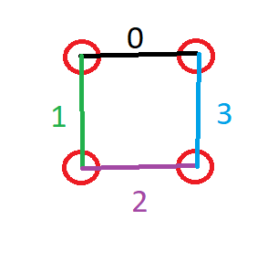

---

---

# Assignment 2: Romi-RPi I2C control

##### Task 01: Issue commands from RPi to Romi control board using I2C to drive in a circle

Python code for the Raspberry Pi 4 has been developed from the [Romi-RPi-I2CSlave](https://github.com/venki666/CpE476_demos/tree/master/Arduino/Romi-RPi-I2CSlave) *examples* codes. The Python codes located inside that directory will not run without the necessary romi-driver python module, which can be found [here](https://github.com/ftPeter/RomiPi/tree/master/romipi_astar/src). Note that the entire directory has to be located in the *examples* folder in order for python to detect the module.

The **motor_test.py** and the **keyboard_motor.py** example codes demonstrate how the romi-driver module can be used to control the motors of the robot. Specifically, a while(true) loop was created to continuously write send the twist command to the Romi control board. A break statement was included to break this infinite loop and end the **asst2_circle.py** program and reclaim control of the RPi without the need for a ***Ctrl + C*** command issued to the terminal.

***Romi-RPi circle demo:*** https://youtu.be/HzMTyNinZ5k

##### Task 02: Issue commands from RPi to the Romi Control board using I2C to drive in a square

The **asst2_circle.py** program was then used to develop the **asst2_square.py** program. The square path was implemented using the same programming techniques described in the [Assignment 1 task 02](https://github.com/kirkster96/DqF587-not-robots/blob/master/Assignment1/Assignment_1.md). Additionally, new code has been developed that counts and prints the number of laps to perform and the number of laps completed by the robot. This was implemented by representing the path as a graph (Figure 1) where the nodes are the stopping points and the edges are the paths taken by the robot. By numbering the edges, it is understood that after every 3rd edge a lap is completed and the edge counter should reset to zero. In the **asst2_square.py** program, **i** is the counter used to count the edges. A simple if statement checks when **i** reaches 3 and resets it while also incrementing the lap and printing the lap.

***Romi-RPi square demo:*** https://youtu.be/HzNelc9EMkQ

